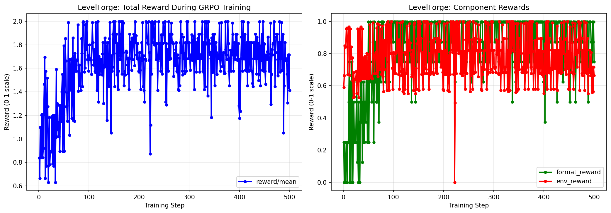
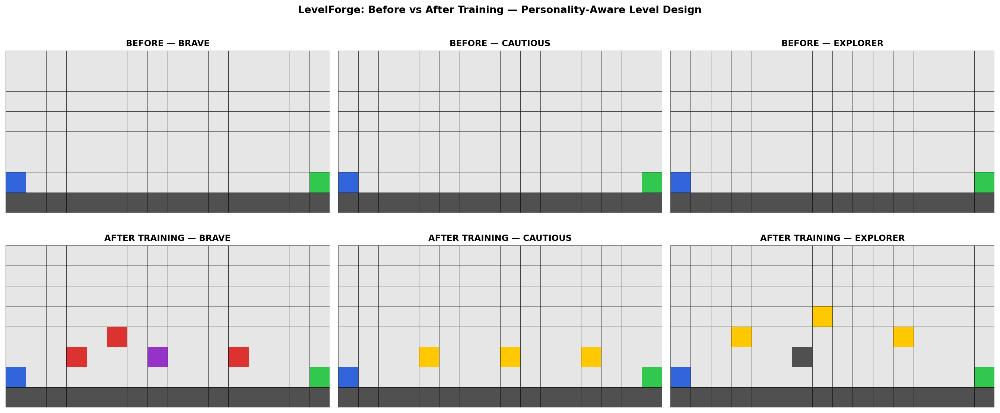

# LevelForge — AI Game Level Designer

> Training a small LLM to design 2D platformer levels for different player personalities using GRPO and A* pathfinding rewards.

[](https://huggingface.co/spaces/pranavgadodia/levelforge-env)
[](https://github.com/Pranavpro23/levelforge_env)
[](https://meta-pytorch.org/OpenEnv/)

---

## The Problem

I build indie games. Level design is the hardest and most time-consuming part — weeks of work to create stages that feel fair, fun, and different for different types of players. A brave player wants spike-filled gauntlets. A cautious player wants wide open paths. An explorer wants hidden secrets.

**LevelForge trains a 0.5B language model to design levels automatically for each personality type** — graded entirely by A* pathfinding math, no LLM judge needed.

---

## What The Agent Learns

The agent receives an 8×16 grid and must place tiles to create a playable level:

| Tile | Symbol | Meaning |
|------|--------|---------|
| Empty | `.` | Open space |
| Wall | `#` | Platform or floor |
| Spike | `^` | Kills player (blocks A* path) |
| Coin | `$` | Collectible |
| Enemy | `E` | Hazard |
| Player | `P` | Start position |
| Goal | `G` | End position |

The agent is told a **player personality** and must design accordingly:
- **Brave** → dangerous levels with many spikes and enemies
- **Cautious** → wide open paths with few hazards
- **Explorer** → multiple branching routes with hidden coins

---

## Three Tasks (Easy → Hard)

| Task | Difficulty | What Agent Must Do |
|------|-----------|-------------------|
| `first_steps` | Easy | Add coins + spikes to a pre-built floor |
| `gap_jumper` | Medium | Add platforms across gaps + coins + enemy |
| `symmetric_shrine` | Hard | Design complete level from scratch for given personality |

---

## Reward Function (Pure Python — No LLM Judge)

```
R = 2.0 × solvable          (A* finds path P→G — hard gate)
  + 1.0 × difficulty_band   (Gaussian at target path length)
  + 0.5 × coin_reachable    (coins on the A* path)
  + 0.5 × symmetry          (aesthetic layout quality)
  + 0.5 × personality_match (level suits the player type)
  + 0.25 × format_score     (XML reasoning tags present)
```

All components strictly between 0.0 and 1.0. Total normalised to 0–1 range.
Unsolvable levels are capped at 0.2 regardless of other scores.

---

## Training

- **Model:** Qwen2.5-0.5B-Instruct with Unsloth QLoRA (4-bit, r=32)
- **Algorithm:** GRPO (Group Relative Policy Optimization) via HuggingFace TRL
- **Dataset:** 200 prompts across 3 tasks × 3 personalities
- **Hardware:** T4 GPU (Colab free tier)
- **Steps:** 200 GRPO training steps

### Training Notebook

[](https://colab.research.google.com/github/Pranavpro23/levelforge_env/blob/main/training/train_grpo.ipynb)

---

## Results

<!-- reward_curve.png will be embedded here after training -->

*Reward improvement over 200 GRPO training steps. Format reward rises first (steps 0-30), followed by environment reward as model learns to design solvable levels.*

<!-- personality_comparison.png will be embedded here -->

*Left: Brave player levels (high spikes/enemies). Center: Cautious player levels (wide open). Right: Explorer levels (branching paths). Rows show step 0 → 100 → 200.*

---

## Quick Start

### Connect to the live environment

```python
from levelforge_env import LevelTrailAction, LevelTrailEnv

with LevelTrailEnv(base_url="https://pranavgadodia-levelforge-env.hf.space") as env:
    obs = env.reset("first_steps", "brave")
    result = env.step(LevelTrailAction(
        reasoning="<think>I will place spikes for a brave player</think>",
        edits=[{"row": 5, "col": 3, "tile": "^"}],
        declare_done=False
    ))
    print(f"Reward: {result.reward.total}")
```

### Run locally with Docker

```bash
git clone https://github.com/Pranavpro23/levelforge_env
cd levelforge_env
docker build -f server/Dockerfile -t levelforge-env .
docker run -p 7860:7860 levelforge-env
```

### Test the API

```bash
# Health check
curl https://pranavgadodia-levelforge-env.hf.space/health

# Start episode
curl -X POST https://pranavgadodia-levelforge-env.hf.space/reset \
  -H "Content-Type: application/json" \
  -d '{"task_name": "first_steps", "personality": "brave"}'

# Take action
curl -X POST https://pranavgadodia-levelforge-env.hf.space/step \
  -H "Content-Type: application/json" \
  -d '{"reasoning": "<think>placing a coin</think>", "edits": [{"row": 5, "col": 3, "tile": "$"}], "declare_done": false}'
```

---

## Project Structure

```
levelforge_env/
├── inference.py          OpenEnv inference script [START][STEP][END] format
├── openenv.yaml          ← Environment manifest (3 tasks defined)
├── models.py             ← Pydantic models: Observation, Action, Reward
├── client.py             ← LevelTrailEnv client class
├── server/
│   ├── app.py            ← FastAPI server (/reset /step /state /health)
│   ├── environment.py    ← Episode logic + state management
│   ├── tilemap.py        ← 8×16 grid + tile definitions
│   ├── astar.py          ← A* pathfinder (verifiable reward)
│   ├── renderer.py       ← Pygame grid → PNG → GIF
│   ├── rewards.py        ← 6 reward functions (pure Python)
│   ├── scenarios.py      ← 30 pre-built training scenarios
│   └── Dockerfile
└── training/
    └── train_grpo.ipynb  ← GRPO training notebook (Colab)
```

---

## Environment Spec (openenv.yaml)

- **3 tasks** with difficulty progression (easy → medium → hard)
- **Deterministic reward** — pure Python A* verification

---

## Why This Matters

Procedural content generation (PCG) for games has been dominated by CNNs and rule-based systems. **LevelForge is the first OpenEnv environment that trains a language model to generate game levels using RL** — with a game engine verifier (A* pathfinding) as the reward signal.

This opens the door to personality-aware level generation: the same model learns to produce fundamentally different levels for different player archetypes, trained entirely from reward signals with no human-labeled data.

---

## Links

- 🤗 **HF Space:** https://huggingface.co/spaces/pranavgadodia/levelforge-env
- 💻 **GitHub:** https://github.com/Pranavpro23/levelforge_env
- 📓 **Training Notebook:** training/train_grpo.ipynb
- 📝 **Mini-blog:** [coming after training]
- 🎥 **Demo video:** [coming after training]

---

*Built for Meta PyTorch OpenEnv Hackathon × Scaler School of Technology, India 2026*
